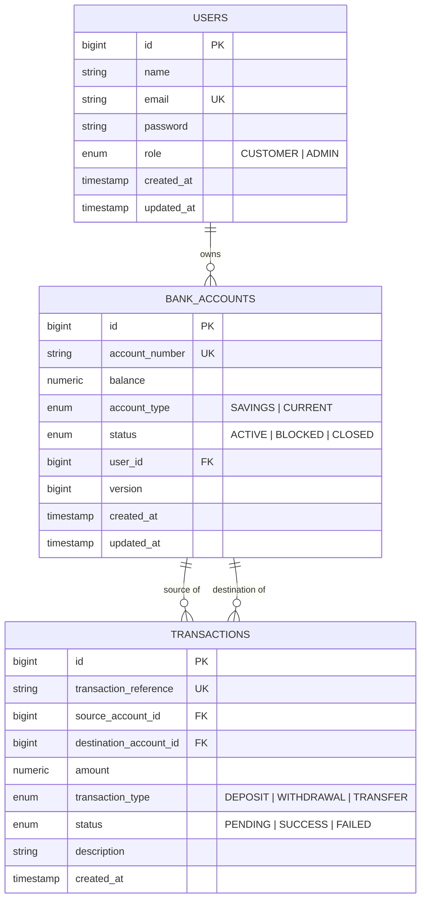

# Production-Style Banking Transaction Management System

[](https://www.oracle.com/java/)
[](https://spring.io/projects/spring-boot)
[](https://spring.io/projects/spring-security)
[](https://www.postgresql.org/)
[](https://www.docker.com/)

A secure, high-throughput, enterprise-ready **Banking Transaction Management System** REST API built using **Java 17**, **Spring Boot 3.x**, **Spring Security**, **JWT Authentication**, **Spring Data JPA**, **PostgreSQL**, and **Docker Compose**. 

The system features robust pessimistic locking for concurrent transaction consistency, preventing double-spending, race conditions, and negative balances during simultaneous high-frequency money transfers.

---

## 1. Project Overview

The Banking Transaction Management System provides secure digital banking capabilities for Customers and Financial Administrators:
- **User Authentication**: Secure registration and login issuing stateless JSON Web Tokens (JWT).
- **Role-Based Access Control (RBAC)**: Fine-grained permissions for `CUSTOMER` and `ADMIN` roles using `@PreAuthorize` security annotations.
- **Account Management**: Support for `SAVINGS` and `CURRENT` bank accounts with lifecycle status tracking (`ACTIVE`, `BLOCKED`, `CLOSED`).
- **Financial Engine**: High-concurrency operations for Deposits, Withdrawals, and Account-to-Account Transfers.
- **Transaction History**: Audit logging and reference-based transaction tracking with pagination and sorting.

---

## 2. Key Features

- **Stateless JWT Security**: Passwords hashed with BCrypt; all protected endpoints verified via `JwtAuthenticationFilter`.
- **Concurrency Safety**: Pessimistic Write Locking (`@Lock(LockModeType.PESSIMISTIC_WRITE)`) prevents race conditions, lost updates, and double spending.
- **Deadlock Prevention**: Deterministic lock ordering during transfers (`Math.min(idA, idB)` first, then `Math.max(idA, idB)`).
- **Comprehensive Validation**: Request validation using Jakarta Bean Validation (`@NotNull`, `@Positive`, `@Email`, `@Size`).
- **Standardized Error Handling**: Global exception handler (`@RestControllerAdvice`) returning structured JSON error payloads with RFC 7807 compliant HTTP status codes (400, 401, 403, 404, 409, 500).
- **Interactive Documentation**: OpenAPI 3.0 / Swagger UI integration at `/swagger-ui.html`.
- **Production Containerization**: Multi-stage Dockerfile and Docker Compose setup for instant deployment.

---

## 3. Architecture

Layered architecture following **SOLID principles**:

```text
       Client / Swagger UI / Postman
                   │
                   ▼
┌──────────────────────────────────────────┐
│             Controller Layer             │ (REST Endpoints & Request Validation)
└──────────────────┬───────────────────────┘
                   │
                   ▼
┌──────────────────────────────────────────┐
│              Service Layer               │ (Business Logic & Transaction Boundaries)
└──────────────────┬───────────────────────┘
                   │
                   ▼
┌──────────────────────────────────────────┐
│             Repository Layer             │ (Spring Data JPA & Pessimistic Locks)
└──────────────────┬───────────────────────┘
                   │
                   ▼
┌──────────────────────────────────────────┐
│            PostgreSQL / H2               │ (Database Persistence)
└──────────────────────────────────────────┘
```

### Package Structure

```text
com.banking
├── config/             # Spring Security, OpenAPI, App config
├── controller/         # AuthController, AccountController, TransactionController, UserController
├── dto/                # Request & Response DTOs (RegisterRequest, TransferRequest, etc.)
├── entity/             # User, BankAccount, Transaction, Enums, BaseEntity
├── exception/          # Custom Exceptions & GlobalExceptionHandler
├── mapper/             # Entity <-> DTO conversion mappers
├── repository/         # UserRepository, BankAccountRepository, TransactionRepository
├── security/           # JwtTokenProvider, JwtAuthenticationFilter, UserPrincipal
├── service/            # AuthService, AccountService, TransactionService, UserService
│   └── impl/           # Business logic implementations
└── BankingApplication.java
```

---

## 4. Technology Stack

| Component | Technology |
| :--- | :--- |
| **Language** | Java 17 |
| **Framework** | Spring Boot 3.3.3 |
| **Security** | Spring Security 6, JWT (`jjwt 0.12.6`), BCrypt |
| **Persistence** | Spring Data JPA, Hibernate ORM |
| **Databases** | PostgreSQL 16 (Production/Docker), H2 (In-Memory for Tests) |
| **Documentation** | Springdoc OpenAPI / Swagger UI 2.6 |
| **Build & Test** | Maven, JUnit 5, Mockito, Spring Boot Test |
| **Containerization** | Docker, Docker Compose |

---

## 5. Database Schema



---

## 6. Concurrency Strategy

### The Problem
When two concurrent requests attempt to withdraw from or transfer out of the same account simultaneously:
```text
Initial Balance: ₹10,000

Request A (Thread 1) -> Withdraw ₹7,000
Request B (Thread 2) -> Withdraw ₹6,000
```
Without proper locking, both threads read balance = ₹10,000. Thread 1 updates balance to ₹3,000, and Thread 2 overwrites balance to ₹4,000 (Lost Update) or both succeed resulting in a negative balance (₹-3,000).

### Our Solution: Pessimistic Write Locking & Lock Ordering
1. **Pessimistic Write Locking (`PESSIMISTIC_WRITE`)**:
   During money movement, accounts are queried using `@Lock(LockModeType.PESSIMISTIC_WRITE)`:
   ```sql
   SELECT * FROM bank_accounts WHERE id = ? FOR UPDATE;
   ```
   This acquires an exclusive database row lock, blocking concurrent transactions until the current `@Transactional` boundary finishes.

2. **Deadlock Prevention in Transfers**:
   If Thread 1 transfers A → B while Thread 2 transfers B → A, naive locking causes a deadlock. We enforce **Deterministic ID Lock Acquisition**:
   ```java
   Long firstLockId = Math.min(sourceId, destId);
   Long secondLockId = Math.max(sourceId, destId);
   
   // Always lock lower ID first, then higher ID
   BankAccount firstLocked = accountRepository.findByIdWithLock(firstLockId)...;
   BankAccount secondLocked = accountRepository.findByIdWithLock(secondLockId)...;
   ```

---

## 7. API Endpoints

### Authentication (`/api/auth`)
| Method | Endpoint | Description | Auth Required |
| :--- | :--- | :--- | :--- |
| `POST` | `/api/auth/register` | Register new user | Public |
| `POST` | `/api/auth/login` | Login and receive Bearer JWT | Public |

### Account Management (`/api/accounts`)
| Method | Endpoint | Description | Auth Required |
| :--- | :--- | :--- | :--- |
| `POST` | `/api/accounts` | Create bank account | Authenticated |
| `GET` | `/api/accounts` | List user accounts (Admin views all) | Authenticated |
| `GET` | `/api/accounts/{id}` | Get account details | Account Owner / Admin |
| `GET` | `/api/accounts/{id}/balance` | Check account balance | Account Owner / Admin |
| `PATCH`| `/api/accounts/{id}/status` | Update account status | ADMIN Only |
| `DELETE`| `/api/accounts/{id}` | Close bank account | ADMIN Only |

### Transactions (`/api/transactions`)
| Method | Endpoint | Description | Auth Required |
| :--- | :--- | :--- | :--- |
| `POST` | `/api/transactions/deposit` | Deposit funds into account | Account Owner / Admin |
| `POST` | `/api/transactions/withdraw` | Withdraw funds from account | Account Owner / Admin |
| `POST` | `/api/transactions/transfer` | Account-to-Account transfer | Account Owner / Admin |
| `GET` | `/api/transactions` | Paginated transaction history | Authenticated |
| `GET` | `/api/transactions/{reference}` | Get transaction by reference | Authorized User |

### Admin User Management (`/api/admin/users`)
| Method | Endpoint | Description | Auth Required |
| :--- | :--- | :--- | :--- |
| `GET` | `/api/admin/users` | List all system users | ADMIN Only |
| `GET` | `/api/admin/users/{id}` | Get user details by ID | ADMIN Only |

---

## 8. Sample Request & Response Payloads

### 1. User Registration
`POST /api/auth/register`
```json
{
  "name": "Alice Smith",
  "email": "alice@banking.com",
  "password": "password123",
  "role": "CUSTOMER"
}
```
*Response (201 Created):*
```json
{
  "id": 1,
  "name": "Alice Smith",
  "email": "alice@banking.com",
  "role": "CUSTOMER",
  "createdAt": "2026-09-18T14:00:00"
}
```

### 2. User Login
`POST /api/auth/login`
```json
{
  "email": "alice@banking.com",
  "password": "password123"
}
```
*Response (200 OK):*
```json
{
  "token": "eyJhbGciOiJIUzI1NiJ9.eyJzdWIiOiJhbGljZUBiYW5raW5nLmNvbSI...",
  "tokenType": "Bearer",
  "email": "alice@banking.com",
  "role": "CUSTOMER"
}
```

### 3. Account-to-Account Transfer
`POST /api/transactions/transfer`
*Headers:* `Authorization: Bearer <JWT_TOKEN>`
```json
{
  "sourceAccountId": 1,
  "destinationAccountId": 2,
  "amount": 1500.00,
  "description": "Monthly rent payment"
}
```
*Response (201 Created):*
```json
{
  "id": 45,
  "transactionReference": "TXN-8F92A1D0E4C1",
  "sourceAccountId": 1,
  "sourceAccountNumber": "1098472918",
  "destinationAccountId": 2,
  "destinationAccountNumber": "5839201948",
  "amount": 1500.00,
  "transactionType": "TRANSFER",
  "status": "SUCCESS",
  "description": "Monthly rent payment",
  "createdAt": "2026-09-18T14:15:00"
}
```

---

## 9. Local Development & Building

### Prerequisites
- Java 17+ JDK installed
- Maven (or use `./mvnw.cmd` / `./mvnw`)

### Running Automated Tests
```bash
# Windows
.\mvnw.cmd test

# Linux / macOS
./mvnw test
```

### Building Application JAR
```bash
# Windows
.\mvnw.cmd clean package

# Linux / macOS
./mvnw clean package
```

---

## 10. Environment Variables

Create a `.env` file based on `.env.example`:

| Environment Variable | Default Value | Description |
| :--- | :--- | :--- |
| `DB_HOST` | `localhost` | PostgreSQL host address |
| `DB_PORT` | `5432` | PostgreSQL port |
| `DB_NAME` | `banking_db` | PostgreSQL database name |
| `DB_USERNAME` | `postgres` | Database username |
| `DB_PASSWORD` | `postgres` | Database password |
| `JWT_SECRET` | `404E6352...` | 256-bit HMAC secret key |
| `SERVER_PORT` | `8080` | Application HTTP port |

---

## 11. Docker Deployment

Launch the complete stack (Spring Boot App + PostgreSQL 16 Database) using Docker Compose:

```bash
docker compose up --build
```

The application will be accessible at:
- **REST API**: `http://localhost:8080/api`
- **Swagger UI**: `http://localhost:8080/swagger-ui.html`

To stop and remove containers:
```bash
docker compose down -v
```

---

## 12. Screenshots & API Documentation

Access Swagger UI directly in your browser: `http://localhost:8080/swagger-ui.html`

- Execute `POST /api/auth/register` and `POST /api/auth/login`.
- Copy the returned JWT token.
- Click the **Authorize** button at the top right of Swagger UI and paste `Bearer <JWT_TOKEN>`.
- Test all protected account and transaction APIs interactively!

---

## 13. Future Improvements

- Add Redis caching for user sessions and account balance lookups.
- Integrate Kafka / RabbitMQ for async event-driven transaction notifications.
- Implement multi-currency exchange rate conversions.
- Add daily transaction limit checks and fraud detection rules.
